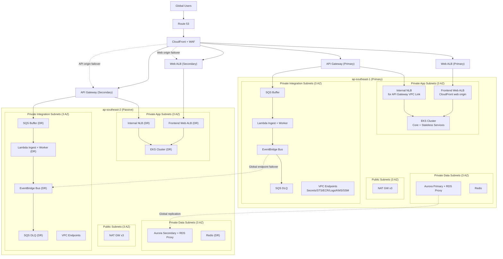

# Detailed Diagram Spec (Regional Subnets + EDA)

```mermaid
flowchart TB
  U["Global Users"] --> R53["Route 53"] --> CF["CloudFront + WAF"]
  CF --> WEBP["Web ALB (Primary)"]
  CF --> WEBS["Web ALB (Secondary)"]
  CF --> APIP["API Gateway (Primary)"]
  CF --> APIS["API Gateway (Secondary)"]

  subgraph P["ap-southeast-1 (Primary)"]
    subgraph PPUB["Public Subnets (3 AZ)"]
      NATP["NAT GW x3"]
    end

    subgraph PAPP["Private App Subnets (3 AZ)"]
      EKS1["EKS Cluster\nCore + Stateless Services"]
      WALB1["Frontend Web ALB\nCloudFront web origin"]
      NLB1["Internal NLB\nfor API Gateway VPC Link"]
    end

    subgraph PDATA["Private Data Subnets (3 AZ)"]
      RDS1["Aurora Primary + RDS Proxy"]
      REDIS1["Redis"]
    end

    subgraph PINT["Private Integration Subnets (3 AZ)"]
      LAM1["Lambda Ingest + Worker"]
      EVB1["EventBridge Bus"]
      SQS1["SQS Buffer"]
      DLQ1["SQS DLQ"]
      VPCE1["VPC Endpoints\nSecrets/STS/ECR/Logs/KMS/SSM"]
    end
  end

  subgraph S["ap-southeast-2 (Passive)"]
    subgraph SPUB["Public Subnets (3 AZ)"]
      NATS["NAT GW x3"]
    end

    subgraph SAPP["Private App Subnets (3 AZ)"]
      EKS2["EKS Cluster (DR)"]
      WALB2["Frontend Web ALB (DR)"]
      NLB2["Internal NLB (DR)"]
    end

    subgraph SDATA["Private Data Subnets (3 AZ)"]
      RDS2["Aurora Secondary + RDS Proxy"]
      REDIS2["Redis (DR)"]
    end

    subgraph SINT["Private Integration Subnets (3 AZ)"]
      LAM2["Lambda Ingest + Worker (DR)"]
      EVB2["EventBridge Bus (DR)"]
      SQS2["SQS Buffer (DR)"]
      DLQ2["SQS DLQ (DR)"]
      VPCE2["VPC Endpoints"]
    end
  end

  WEBP --> WALB1 --> EKS1
  WEBS --> WALB2 --> EKS2
  APIP --> NLB1 --> EKS1
  APIS --> NLB2 --> EKS2
  APIP --> SQS1 --> LAM1 --> EVB1
  APIS --> SQS2 --> LAM2 --> EVB2
  EVB1 --> DLQ1
  EVB2 --> DLQ2
  RDS1 -. "Global replication" .-> RDS2
  EVB1 -. "Global endpoint failover" .-> EVB2
  CF -. "Web origin failover" .-> WEBS
  CF -. "API origin failover" .-> APIS
```
